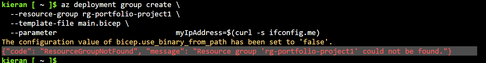
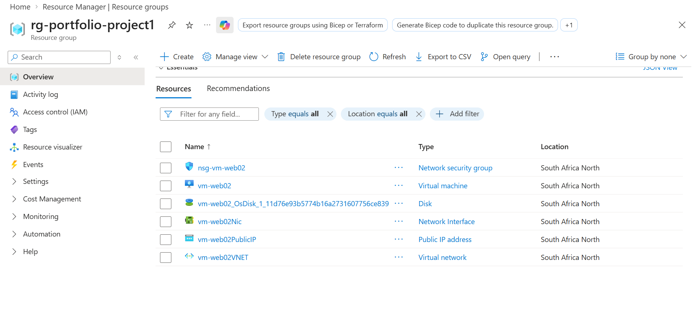
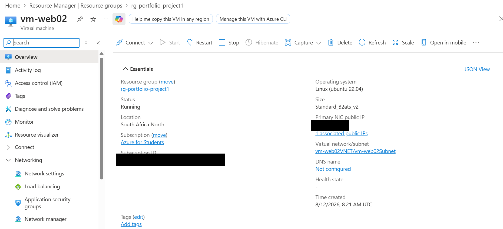
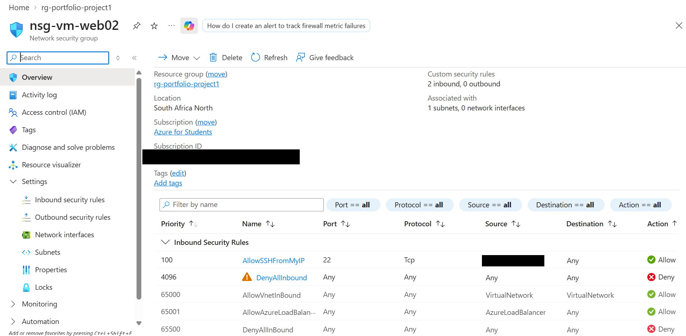

# Portfolio Project

Hands-on Azure projects built to demonstrate practical skills gained through my AZ-900 and AZ-104 certifications. This repo documents the full build process — including the tools used, configuration steps, and issues I ran into along the way — so potential employers can see how I work, not just the end result.

## Skills Demonstrated

- Azure Virtual Machine deployment
- Network Security Group (NSG) configuration
- Infrastructure as Code (Bicep)
- Azure Cloud Shell / Azure CLI administration

---

## Project 1: VM Deployment & NSG Configuration

**Goal:** Deploy a virtual machine on Azure's free tier and secure it with a Network Security Group.

**Tools used:** Azure Cloud Shell (Bash / Azure CLI)

### Steps

1. **Created the resource group**
   
   Commit: [ed7b071](https://github.com/salokieran1-cell/Portfolio-Project/commit/ed7b071ac7ee732c9dd3a4cc88549805287a3c02)

2. **Created the virtual machine**
   
   Commit: [aa79b81](https://github.com/salokieran1-cell/Portfolio-Project/commit/aa79b81b547c8c9294e8e9697aa559125fd4e398)

   Azure flagged that this VM wasn't created with Trusted Launch (secure boot + vTPM) enabled. For this learning project I used the default configuration, but in a production scenario I'd enable Trusted Launch at creation time — `--security-type TrustedLaunch` — to protect against boot-level threats like rootkits.

3. **Configured the Network Security Group**
   
   Commit: [e43a716](https://github.com/salokieran1-cell/Portfolio-Project/commit/e43a716f03b2f66034e988c2765381b9a473a562)

   Configured the NSG for least-privilege inbound access:
   - Deny-all baseline rule (priority 4096)
   - SSH allow scoped to my IP only (priority 100)
   - Attached the NSG directly to the VM's network interface

### Notes / Troubleshooting

- **Local PowerShell/Az module bug**: hit a `WriteObject`/`WriteError` threading error using the `New-AzVm` cmdlet, both locally and initially in Cloud Shell's PowerShell mode. This turned out to be a documented issue in the cmdlet itself, not an environment problem — adjusting `$ProgressPreference` and reinstalling the Az module didn't resolve it. Switched to Azure CLI (Bash) in Cloud Shell instead, which uses a different code path and isn't affected by the bug.
- **`SkuNotAvailable` error**: `Standard_B1s` wasn't available in the `southafricanorth` region at the time of deployment (a capacity constraint on Azure's side, not a config issue). Resolved by switching to `Standard_B2ats_v2`, another free-tier-eligible burstable size.
- **`MissingSubscriptionRegistration` error**: new subscription hadn't yet registered the `Microsoft.Compute` resource provider — a one-time step required before first use. Resolved with `az provider register --namespace Microsoft.Compute`.

---

## Project 2: Infrastructure as Code (Bicep)

**Goal:** Rebuild Project 1's VM + NSG deployment using a Bicep template for repeatable, automated infrastructure.

**Tools used:** Azure CLI, Bicep

### Steps

1. **Wrote the Bicep template** (`main.bicep`) defining the VM, NSG, VNet, Public IP, and NIC as code
   Commit: [link to commit]

2. **Deployed the template via Azure CLI**
   
   Commit: [link to commit]

3. **Verified all resources deployed together in the resource group**
   

4. **Confirmed the VM is running with the expected configuration**
   

5. **Verified the NSG rules match Project 1's manual configuration exactly**
   

   This is the core proof point of this project: the same secure, least-privilege posture from Project 1 (deny-all baseline + SSH scoped to my IP) was reproduced automatically through code, rather than manual configuration.

### Notes / Troubleshooting

- **`IPv4BasicSkuPublicIpCountLimitReached`**: the original template requested a Basic SKU public IP, but Azure retired Basic SKU public IPs (completed September 2025) and most subscriptions now have a limit of 0. Project 1's `az vm create` had defaulted to Standard SKU automatically, which is why this didn't surface until writing the template explicitly. Fixed by changing the `publicIPAddresses` resource to `sku: { name: 'Standard' }` with `publicIPAllocationMethod: 'Static'` (Standard SKU requires static allocation).
- **Resource group had been deleted** between sessions (deleted intentionally to avoid idle credit usage while away from the laptop). Recreated the empty resource group with one command, then re-ran the same Bicep deployment to rebuild everything else — a practical demonstration of what Infrastructure as Code is actually for: fast, repeatable environment rebuilds instead of redoing manual configuration from scratch.

---

## Appendix: Conditional Access (not completed)

Attempted to configure a Conditional Access policy but hit a licensing wall: Entra ID P2 trial activation requires organization-level admin rights, which neither my institution-managed tenant nor a newly created personal tenant could provide (personal signup required a business tax ID; the institution's lab environment lacked the necessary role). Pivoted to an Infrastructure-as-Code project instead — understanding licensing and tenant-permission boundaries is itself a real skill for anyone working in Azure administration.

---

## Certifications

- Microsoft Certified: Azure Fundamentals (AZ-900) — **Certified**
- Microsoft Certified: Azure Administrator Associate (AZ-104) — **Certified**
- Microsoft Certified: Cloud and AI Security Engineer Associate (SC-500) — in progress *(AZ-500 retires Aug 31, 2026; pivoted to its replacement, SC-500)*
- Microsoft Certified: Cybersecurity Architect Expert (SC-100) — in progress
- Microsoft Certified: Security Operations Analyst Associate (SC-200) — in progress

## Contact

_(add your LinkedIn / email if you want recruiters to reach out directly)_
