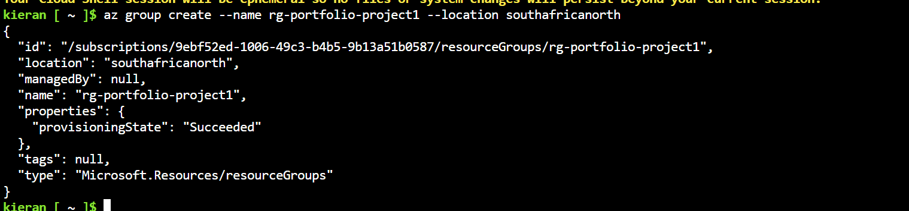
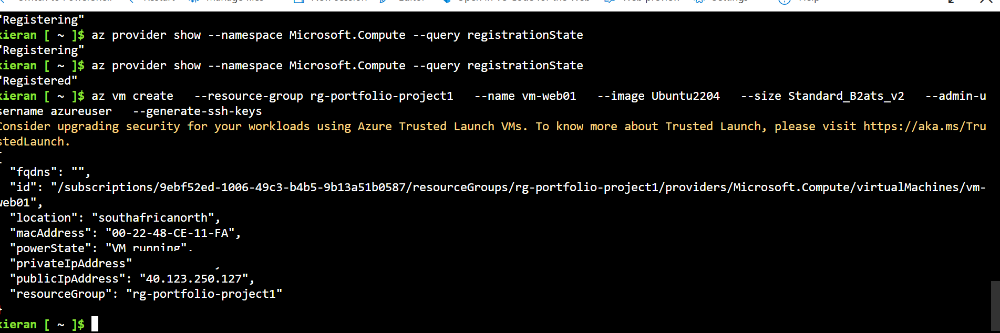
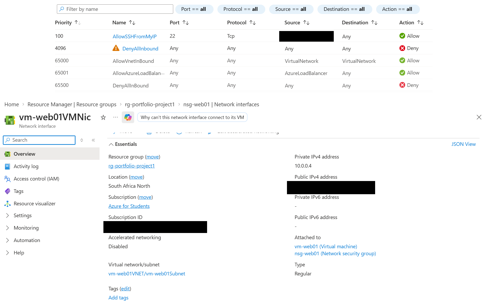

# Portfolio Project

Hands-on Azure projects built to demonstrate practical skills gained through my AZ-900 and AZ-104 certifications. This repo documents the full build process — including the tools used, configuration steps, and issues I ran into along the way — so potential employers can see how I work, not just the end result.

## Skills Demonstrated

- Azure Virtual Machine deployment
- Network Security Group (NSG) configuration
- Conditional Access policy setup
- Azure Cloud Shell / PowerShell administration

---

## Project 1: VM Deployment & NSG Configuration

**Goal:** Deploy a virtual machine on Azure's free tier and secure it with a Network Security Group.

**Tools used:** Azure Cloud Shell (PowerShell)

### Steps

1. **Created the resource group**
   
   Commit: [link to commit]

2. **Created the virtual machine**
   
   Commit: [aa79b81]https://github.com/salokieran1-cell/Portfolio-Project/commit/aa79b81b547c8c9294e8e9697aa559125fd4e398

   Azure flagged that this VM wasn't created with Trusted Launch (secure boot + vTPM) enabled. For this learning project I used the default configuration, but in a production scenario I'd enable Trusted Launch at creation time — `--security-type TrustedLaunch` — to protect against boot-level threats like rootkits.

3. **Configured the Network Security Group**
   
   Commit: [link to commit]

### Notes / Troubleshooting

Ran into a local PowerShell/Az module threading bug (`WriteObject`/`WriteError` error) that persisted even after adjusting `$ProgressPreference` and reinstalling the Az module. Switched to Azure Cloud Shell (browser-based) to continue the same commands — a good example of adapting when a local environment gets in the way of the task at hand.

---

## Project 2: Conditional Access

**Goal:** Configure a Conditional Access policy to control sign-in requirements.

**Tools used:** Azure Portal

### Steps

1. **Set up the Conditional Access policy**
   
   Commit: [link to commit]

### Notes / Troubleshooting

_(fill in as you go)_

---

## Certifications

- Microsoft Certified: Azure Fundamentals (AZ-900)
- Microsoft Certified: Azure Administrator Associate (AZ-104) — *in progress*

## Contact

_(add your LinkedIn / email if you want recruiters to reach out directly)_
